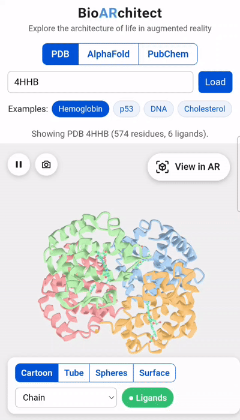

# BioARchitect

**Explore the architecture of life in augmented reality.**

BioARchitect is a web-based viewer that brings proteins, nucleic acids and small molecules into your space. Search a structure, choose how to display it, and place it on your table with your phone's camera. No app installation needed.

  

Open it on your phone and tap **View in AR** to see the structure in augmented reality.

  

## Features

- **Search three databases:** PDB (experimental structures), AlphaFold DB (predicted models by UniProt accession) and PubChem (small molecules by name or CID).
- **Display styles:** cartoon (helices, strands and loops) or tube for proteins and nucleic acids; ball-and-stick for small molecules.
- **Color modes:** AlphaFold confidence (pLDDT), chain, secondary structure and rainbow (N→C).
- **One-tap examples:** a protein, DNA and a lipid to start exploring right away.
- **Augmented reality** on Android and iPhone, directly from the browser.

## 🌿 BioARchitect on the Move

*Take 5 outside.* Science doesn't only happen behind a desk. Inspired by the culture of stepping away from the screen for some fresh air, this section invites you to explore **BioARchitect** outdoors during research stays, walks, and field trips around Hinxton, Cambridge, London, and beyond.

### Share Your Snapshot
Want to submit a photo or get in touch? Click below to send your snapshot and caption directly:

  

## Data Sources

| Database | Description | License / Access |
| :--- | :--- | :--- |
| **[RCSB PDB](https://www.rcsb.org/)** | Experimental macromolecular structures | Public Domain / CC0 |
| **[AlphaFold DB](https://alphafold.ebi.ac.uk/)** | Predicted protein structure models by UniProt accession | [CC BY 4.0](https://creativecommons.org/licenses/by/4.0/) |
| **[PubChem](https://pubchem.ncbi.nlm.nih.gov/)** | Small molecules by name or CID | Public Domain |

## 📄 License

This project is distributed under the terms of the **Academic Evaluation License**. See the [LICENSE](LICENSE) file for more details.

## Author

Created by [Carla Padilla Franzotti](https://cpadillafranzotti.github.io/) · © 2026
