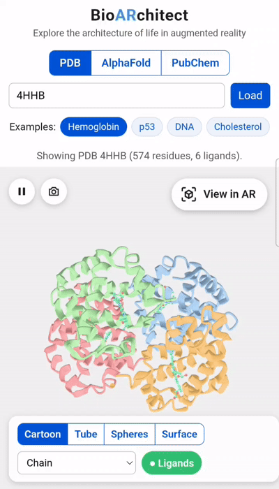

# BioARchitect

**Explore the architecture of life in augmented reality.**

BioARchitect is a web-based viewer that brings proteins, nucleic acids and small molecules into your space. Search a structure, choose how to display it, and place it on your table with your phone's camera. No app to install.

  

  

## Quick start

1. Open the demo on your phone.
2. Pick a database and type an ID or a name, or tap one of the examples.
3. Tap **View in AR**, point your phone at the floor or a table, and move it slowly until the molecule appears.

## Try these

Each link opens a structure ready to explore:

| Structure | What to look for |
|---|---|
| [Hemoglobin](https://cpadillafranzotti.github.io/BioARchitect/?pdb=4HHB) | Four chains carrying four heme groups (tap one to see its name) |
| [p53](https://cpadillafranzotti.github.io/BioARchitect/?alphafold=P04637) | AlphaFold confidence: ordered domains in blue, disordered regions in orange |
| [Top7](https://cpadillafranzotti.github.io/BioARchitect/?pdb=1QYS&style=surface) | The first designed protein with a fold not seen in nature |
| [Hemoglobin surface by charge](https://cpadillafranzotti.github.io/BioARchitect/?pdb=4HHB&style=surface&color=charge) | Positive and negative patches on the protein surface |
| [DNA](https://cpadillafranzotti.github.io/BioARchitect/?pdb=1BNA&color=argentina) | The double helix in the AR palette 🇦🇷 |
| [Caffeine](https://cpadillafranzotti.github.io/BioARchitect/?pubchem=caffeine) | A small molecule, atom by atom |

## Features

- **Search four sources:** PDB (experimental structures, including large mmCIF-only entries), de novo designed proteins (search by keyword, e.g. *barrel*), AlphaFold DB (predicted models by UniProt accession) and PubChem (small molecules by name or CID).
- **Display styles:** cartoon, tube, space-filling spheres and molecular surface for proteins and nucleic acids; ball-and-stick for small molecules.
- **Color modes:** AlphaFold confidence (pLDDT), chain, secondary structure, rainbow (N→C), hydrophobicity, charge, flexibility (B-factor), the AR palette 🇦🇷 and Pride 🏳️‍🌈. See [About the color palettes](#about-the-color-palettes).
- **Tap to identify:** tap any part of the structure to see the residue, nucleotide, ligand or atom (e.g. *Histidine 87 · chain A*). The selected residue lights up in magenta, also in AR.
- **Ligands:** show or hide bound ligands, such as the heme groups of hemoglobin, and see their names, formulas and copies in **Info**.
- **What you are looking at:** each structure shows its ID, whether it is natural, de novo, predicted or a small molecule, and its real size next to its size in AR (*≈ 6 nm · ×100 million in AR*). Tap **Info** for title, organism, method, resolution and links.
- **Share:** send a link that opens the same structure, style and color. Handy for classes, talks and chats.
- **Save what you see:**
  - **PNG:** image with a transparent background, for slides and posters. In AR, use your phone's screenshot.
  - **SVG:** editable vector drawing of the same view (Illustrator, Inkscape, PowerPoint).
  - **PDF:** one-page sheet with the view, its color legend, the entry details, ligands and links.
  - **GLB:** 3D model with its colors, ready to import into Blender or insert into PowerPoint.
  - **STL:** for 3D printing, at 1 Å = 1 mm (hemoglobin ≈ 6.5 cm). Surface and Spheres print best.
- **Augmented reality** on compatible Android phones and iPhones, straight from the browser, with on-screen tips to place, move and resize the model. On a computer, you can explore the structures in 3D.

## About the color palettes

| Palette | What it shows | Source |
|---|---|---|
| Confidence (pLDDT) | How confident AlphaFold is about each residue (0–100) | AlphaFold DB model file |
| Chain | Each polymer chain in a different color | Structure file |
| Secondary structure | Helices, strands and coils | Structure file (HELIX/SHEET records), or assigned from Cα geometry when absent |
| Rainbow (N→C) | Position along each chain, from N- to C-terminus | Structure file |
| Hydrophobicity | Hydrophilic to hydrophobic residues | Kyte & Doolittle hydropathy scale (*J Mol Biol* 1982, 157:105–132) |
| Charge | Side-chain charge at neutral pH: Asp/Glu negative, Lys/Arg positive, His shown apart, polar and nonpolar | Standard residue classification |
| Flexibility (B-factor) | Rigid to mobile regions | B-factors deposited with each experimental structure, scaled within that structure (5th–95th percentile) |
| AR palette 🇦🇷 | Helices celeste, strands Sun of May gold, coils white | Argentine flag |
| Pride 🏳️‍🌈 | Six stripes of the pride flag across the structure | Pride flag |

**Note on flexibility:** B-factors also depend on resolution, crystal packing and refinement, so colors compare regions *within* one structure, not between structures. They are only available for experimental structures; for AlphaFold models, use pLDDT.

## Requirements

- **Android:** Chrome on a phone with [Google Play Services for AR](https://developers.google.com/ar/devices).
- **iPhone / iPad:** Safari.
- **Social media apps** (Instagram, Facebook, TikTok…): their built-in browsers can't open AR. BioARchitect will offer to open the page in your browser.
- **Computer:** any modern browser, in 3D only.

## 🌿 BioARchitect on the Move

*Take 10 outside.* Between experiments or between lines of code, here's a good excuse to go for a walk and get some fresh air. Where would you place a molecule? Drop a protein into your favourite spot and share your snapshot with us.

### Share Your Snapshot

📸 **How to capture it:** while in AR, take a screenshot with your phone.

Want to submit a photo or get in touch? Click below to send your snapshot and caption directly:

  

## 💙 Support BioARchitect

BioARchitect is an independent project. If you find it useful or enjoy it, you can support its development:

  
  

Sharing it, citing it or sending feedback also helps a lot!

## Using BioARchitect in a class or talk?

Go ahead! Please mention **BioARchitect by Carla Padilla Franzotti** and link to the [demo](https://cpadillafranzotti.github.io/BioARchitect/). I'd love to hear how you used it.

## Data Sources

- **[RCSB PDB](https://www.rcsb.org/)**: experimental macromolecular structures, de novo design search and ligand names (Public Domain / CC0).
- **[AlphaFold DB](https://alphafold.ebi.ac.uk/)**: predicted protein structure models by UniProt accession ([CC BY 4.0](https://creativecommons.org/licenses/by/4.0/)).
- **[PubChem](https://pubchem.ncbi.nlm.nih.gov/)**: small molecules by name or CID (Public Domain).

## 📄 License

This project is distributed under the terms of the **Academic Evaluation License – All Rights Reserved**. See the [LICENCE](LICENCE) file for more details.

## Author

Created by [Carla Padilla Franzotti](https://cpadillafranzotti.github.io/) · © 2025–2026
